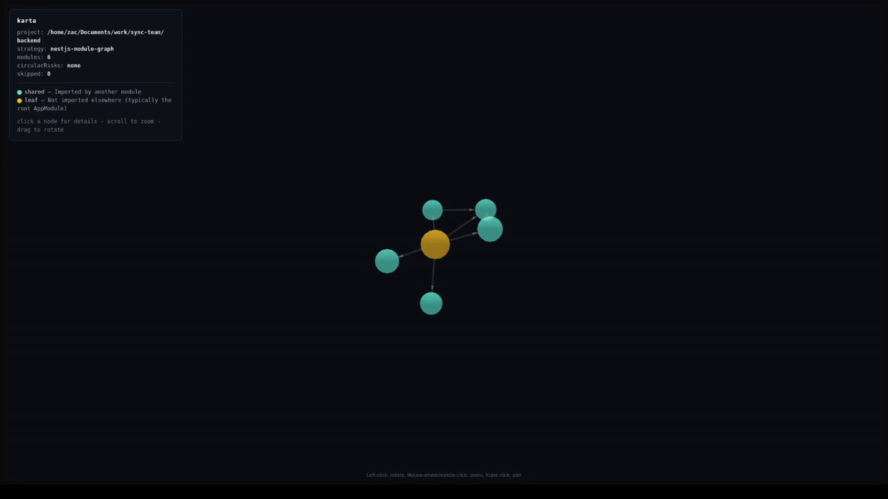

# Karta(ካርታ)

[](https://github.com/zekariasT/karta/actions/workflows/ci.yml)



A local MCP server that gives Claude Code stack-aware exploration tools for an unfamiliar codebase. Karta runs over stdio, exposes five focused tools, and picks a different "architecture graph" strategy depending on whether the target project is **NestJS**, **Next.js**, or **plain Node/TypeScript**.

The goal: a handful of cheap tool calls give Claude Code a mental model of a project — its stack, its module layout, where symbols live — without dumping whole files into context.

## Tools

| Tool | What it does |
| --- | --- |
| `read_project_structure` | Nested JSON tree of folders/files (depth 6, skips `node_modules`, `.git`, `dist`, `.next`, `build`, `coverage`, `.turbo`). |
| `get_tech_stack` | Reads `package.json`; reports framework, dependencies, Node version, and outdated-framework warnings (Next.js < 14, NestJS < 10). |
| `find_relevant_files` | Locates files by keyword across filenames, class/function/variable names; returns up to 10 ranked matches with 3-line snippets. |
| `get_module_summary` | For a given folder, lists each `.ts` file's exported classes/functions/interfaces/types plus a one-line inferred summary. |
| `get_architecture_graph` | Stack-aware graph: NestJS `@Module` decorator graph, Next.js route map, or generic file-import graph with hub detection. |

### Supported stacks → strategy

| Detected stack | Strategy | Output |
| --- | --- | --- |
| NestJS | `nestjs-module-graph` | Each module's `imports` / `providers` / `exports`, `isShared` flag, `circularRisks[]`. |
| Next.js | `nextjs-route-map` | Routes from App Router (`app/`) or Pages Router (`pages/`), with `isClientComponent` flag. |
| Both | `full-stack` | Both result sets under `nestjs` and `nextjs` keys. |
| Plain Node TS | `file-import-graph` | Local-import edges; files imported by ≥3 others are marked `isHub: true`. |

Stack detection looks at `dependencies` + `devDependencies` for `@nestjs/core` and `next`.

## Install

```bash
git clone <this repo>
cd Karta
npm install
npm run build
```

`dist/index.js` is the executable entry point.

## Register with Claude Code

```bash
claude mcp add karta -- node /home/zac/Documents/profile/Karta/dist/index.js
```

Then in a Claude Code session, `/mcp` should list `karta` and its five tools. All tools take `projectPath` (absolute path to the target project) as their first argument.

## Interactive 3D viewer

Karta also ships with a local web viewer that renders the architecture graph as an interactive 3D force-directed graph (powered by [`3d-force-graph`](https://github.com/vasturiano/3d-force-graph)).

```bash
npm run viewer -- --project /path/to/your/project
# or, if installed globally:
karta-viewer --project /path/to/your/project --port 3737
```

Then open <http://localhost:3737> in a browser. Drag to rotate, scroll to zoom, click a node to pin the camera and see its providers / exports / imports (NestJS) or imports / importedBy (generic).

- **NestJS**: nodes = modules. Color = `shared` (imported by something) vs `leaf` (the root). Edges = `imports`. Node size = number of providers.
- **Next.js**: nodes = routes. Color = `page` / `client` / `layout` / `api` / `loading` / `error`. Edges connect layouts to the routes they wrap.
- **Plain Node TS**: nodes = files. Color = `hub` (3+ importers) vs `leaf` vs `entry`. Edges = local imports.

The viewer is stateless — it re-runs the analysis on each page load, so a hard refresh always shows current code.

## Usage tip

Have Claude Code call them in roughly this order on a cold project:

1. `get_tech_stack` — what is this?
2. `read_project_structure` — what's the shape?
3. `get_architecture_graph` — how do the modules/routes/files relate?
4. `find_relevant_files` — where does `<thing>` live?
5. `get_module_summary` — what does this folder expose?

## Example outputs (truncated)

### `get_tech_stack`
```json
{
  "detectedStack": "node",
  "framework": "Node.js",
  "nodeVersion": ">=20",
  "dependencies": [
    { "name": "@modelcontextprotocol/sdk", "version": "^1.0.4" },
    { "name": "ts-morph", "version": "^24.0.0" },
    { "name": "zod", "version": "^3.23.8" }
  ],
  "devDependenciesSummary": { "count": 2, "topLevel": [ /* ... */ ] },
  "warnings": []
}
```

### `read_project_structure`
```json
{
  "root": "Karta",
  "maxDepth": 6,
  "tree": {
    "name": "Karta", "type": "folder", "path": "",
    "children": [
      { "name": "src", "type": "folder", "path": "src", "children": [ /* ... */ ] },
      { "name": "package.json", "type": "file", "path": "package.json" }
    ]
  }
}
```

### `find_relevant_files`
```json
{
  "keyword": "stack",
  "totalCandidates": 4,
  "matches": [
    { "filePath": "src/tools/getTechStack.ts", "matchType": "filename", "matchedName": "getTechStack.ts", "line": 1, "snippet": "..." },
    { "filePath": "src/utils/stackDetector.ts", "matchType": "function", "matchedName": "detectStack", "line": 27, "snippet": "..." }
  ],
  "skipped": []
}
```

### `get_module_summary`
```json
{
  "folder": "src/utils",
  "files": [
    {
      "file": "src/utils/stackDetector.ts",
      "exports": ["readPackageJson (function)", "detectStack (function)", "Stack (type)"],
      "summary": "Exports readPackageJson, detectStack, detectStackFromPackage, parseMajor (functions); Stack (type); PackageJson (interface).",
      "jsdoc": null
    }
  ],
  "skipped": []
}
```

### `get_architecture_graph` (generic strategy on a TS-only project)
```json
{
  "strategy": "file-import-graph",
  "files": [
    {
      "filePath": "src/utils/paths.ts",
      "imports": [],
      "importedBy": ["src/utils/fileWalker.ts", "src/tools/readProjectStructure.ts", "src/tools/getTechStack.ts"],
      "isHub": true
    }
  ],
  "skipped": []
}
```

### `get_architecture_graph` (NestJS strategy)
```json
{
  "strategy": "nestjs-module-graph",
  "modules": [
    {
      "name": "UsersModule",
      "filePath": "src/users/users.module.ts",
      "imports": ["TypeOrmModule.forFeature", "AuthModule"],
      "providers": ["UsersService"],
      "exports": ["UsersService"],
      "isShared": true
    }
  ],
  "circularRisks": [],
  "skipped": []
}
```

### `get_architecture_graph` (Next.js App Router)
```json
{
  "strategy": "nextjs-route-map",
  "routerType": "app",
  "routes": [
    { "route": "/", "filePath": "app/page.tsx", "type": "page", "isClientComponent": false },
    { "route": "/dashboard", "filePath": "app/dashboard/layout.tsx", "type": "layout", "isClientComponent": false },
    { "route": "/dashboard/settings", "filePath": "app/dashboard/settings/page.tsx", "type": "page", "isClientComponent": true }
  ],
  "warnings": [],
  "skipped": []
}
```

## Constraints

- No full file contents in any response — summaries and 3-line snippets only.
- All paths in responses are relative to `projectPath`.
- Each tool aims to stay under 4000 tokens (depth cap, match cap, no file bodies in graphs).
- All AST work goes through `ts-morph` — no regex parsing of source code.
- stdout is reserved for the MCP protocol; diagnostics go to stderr.

## Development

```bash
npm run dev    # tsc --watch
npm run build  # one-shot build into dist/
npm start      # node dist/index.js (stdio; talks to an MCP client)
```

Project layout:

```
src/
  index.ts                       MCP server bootstrap
  tools/                         One file per tool (name, description, inputSchema, handler)
  graphs/                        nestjsGraph / nextjsGraph / genericGraph
  utils/                         paths, fileWalker, tsParser, stackDetector, result
```
